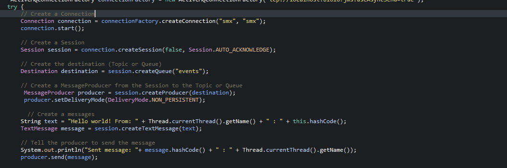

# Arquitectura ESB
## Introduccion 
En este articulo se va a mostarr como a traves de `apache ServiceMix` el cual tiene funcionalidades de ActiveMQ, dado esto el objetivo de este laboratorio es aprender y comprender el patron arquitectural ESB
## Arquitectura

## AWS ServiceMix

## Autor

* **Javier Vargas** - *ECI*

## License

Este proyecto está licenciado bajo GNU  License v3.0 - ver [LICENSE](LICENSE) para más detalles.
